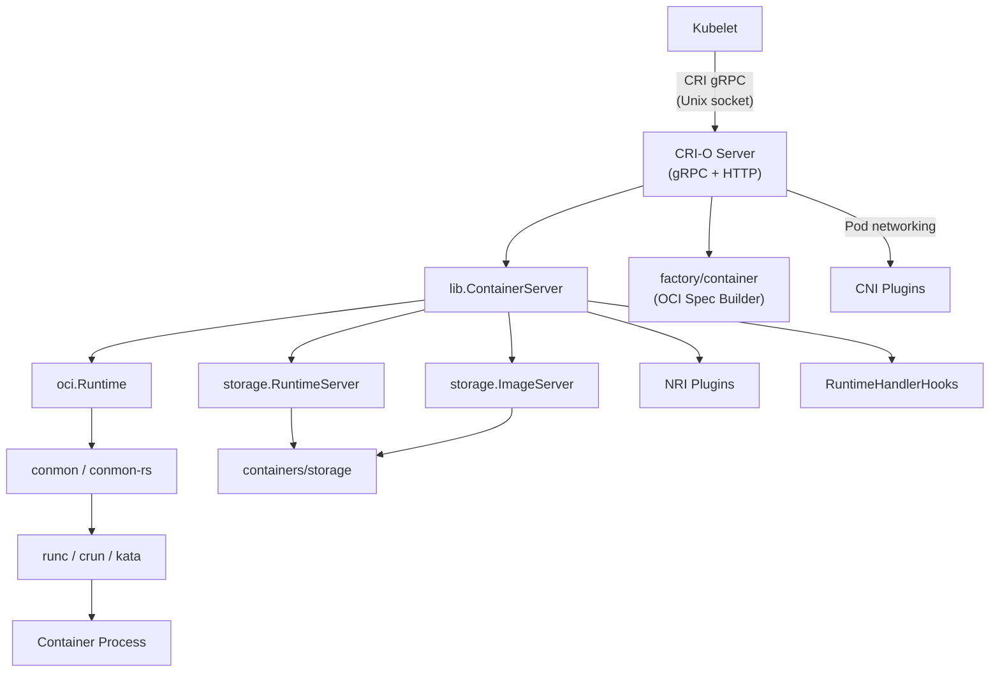
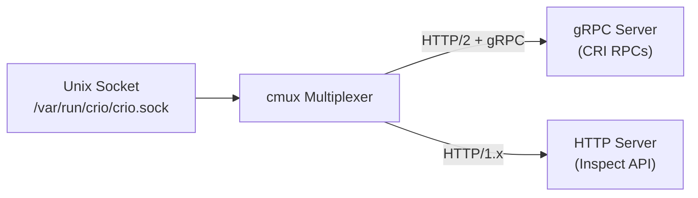
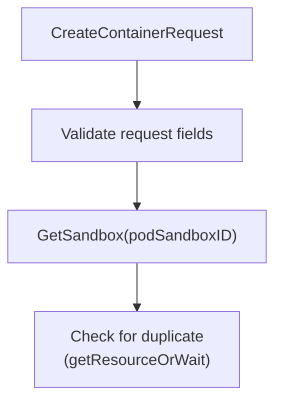
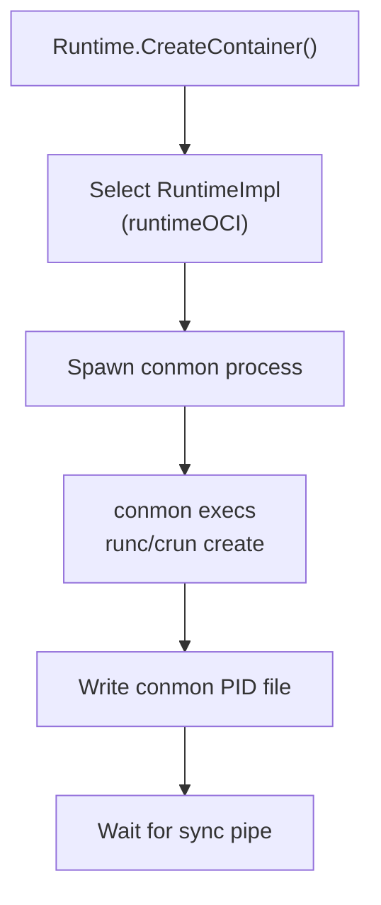
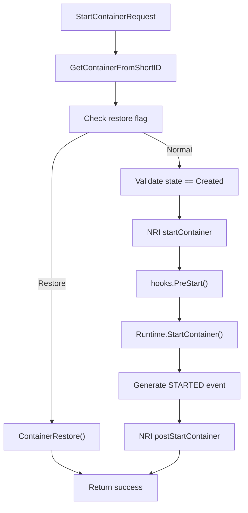
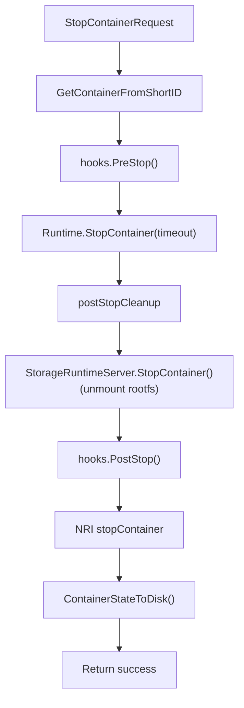
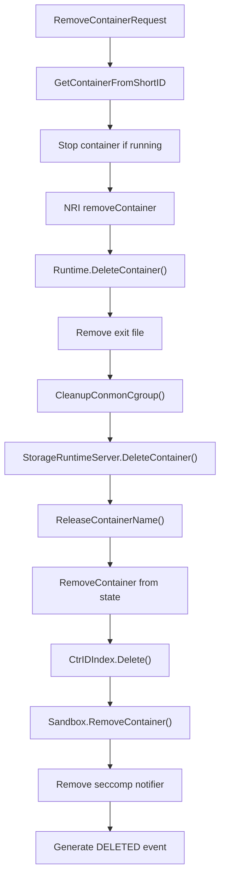
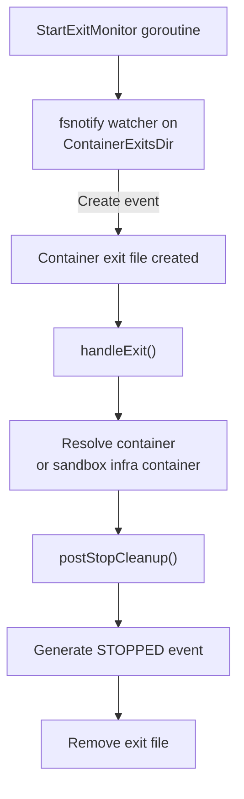
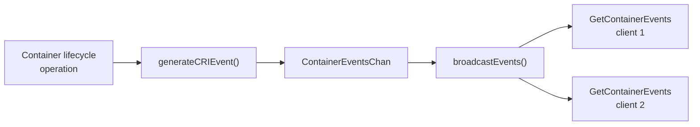
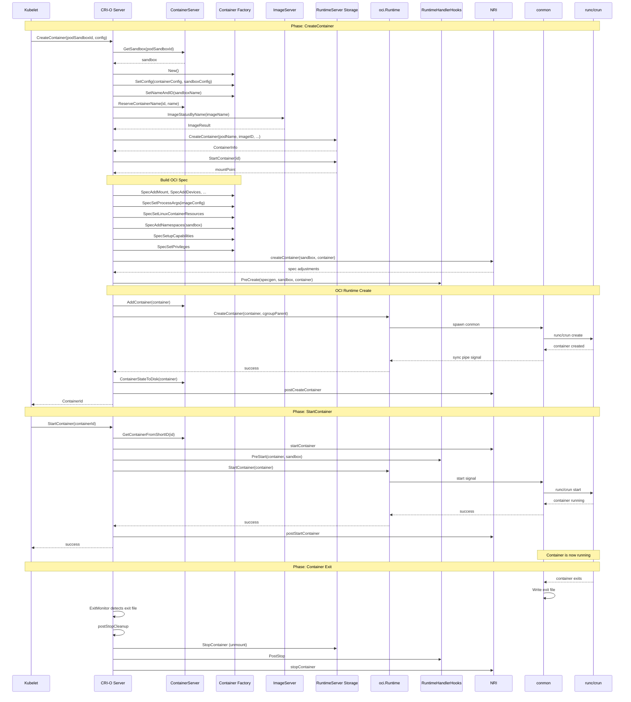

# CRI-O Container Creation Flow

<!-- toc -->

- [Component Roles](#component-roles)
- [RunPodSandbox Flow](#runpodsandbox-flow)
- [StartContainer Flow](#startcontainer-flow)
- [RemoveContainer Flow](#removecontainer-flow)
- [Event Pipeline](#event-pipeline)
- [End-to-End Sequence Diagram](#end-to-end-sequence-diagram)
<!-- /toc -->

See also: [API Reference](api-reference.md) |
[Data Structures Reference](data-structures.md)

---

## Architecture Overview

CRI-O sits between the kubelet and OCI-compliant container runtimes. The
kubelet communicates with CRI-O via the Container Runtime Interface (CRI)
gRPC protocol over a Unix socket. CRI-O translates CRI requests into OCI
runtime operations.

---

## Component Roles

| Component                 | Role                                                             | Source                                                                    |
| ------------------------- | ---------------------------------------------------------------- | ------------------------------------------------------------------------- |
| **Kubelet**               | Kubernetes node agent; sends CRI requests                        | External                                                                  |
| **Server**                | gRPC server implementing CRI RuntimeService and ImageService     | [`server/server.go`](../server/server.go)                                 |
| **ContainerServer**       | Core state management for containers and sandboxes               | [`internal/lib/container_server.go`](../internal/lib/container_server.go) |
| **Container Factory**     | Builds OCI runtime specs from CRI config                         | [`internal/factory/container/`](../internal/factory/container/)           |
| **oci.Runtime**           | Dispatches lifecycle operations to the correct runtime impl      | [`internal/oci/oci.go`](../internal/oci/oci.go)                           |
| **runtimeOCI**            | Manages runc/crun via conmon                                     | [`internal/oci/runtime_oci.go`](../internal/oci/runtime_oci.go)           |
| **runtimeVM**             | Manages VM runtimes (Kata) via ttrpc                             | [`internal/oci/runtime_vm.go`](../internal/oci/runtime_vm.go)             |
| **runtimePod**            | Manages pod-level runtimes via conmon-rs                         | [`internal/oci/runtime_pod.go`](../internal/oci/runtime_pod.go)           |
| **storage.RuntimeServer** | Container storage lifecycle (create, mount, unmount, delete)     | [`internal/storage/runtime.go`](../internal/storage/runtime.go)           |
| **storage.ImageServer**   | Image pull, list, status, delete                                 | [`internal/storage/image.go`](../internal/storage/image.go)               |
| **conmon**                | Container monitor -- holds stdio, tracks exit, writes logs       | External binary                                                           |
| **RuntimeHandlerHooks**   | Lifecycle hooks for runtime-specific behavior (e.g. CPU pinning) | [`internal/runtimehandlerhooks/`](../internal/runtimehandlerhooks/)       |
| **NRI**                   | Node Resource Interface -- external plugin integration           | [`internal/nri/`](../internal/nri/)                                       |
| **CNI**                   | Container Network Interface plugins                              | Via [`internal/config/cnimgr/`](../internal/config/cnimgr/)               |

---

## Server Startup and CRI Registration

### Startup Sequence

The CRI-O daemon starts from [`cmd/crio/main.go`](../cmd/crio/main.go).
The startup sequence is:

1. **Parse configuration** -- Load and validate config from files and CLI
   flags.
2. **Set up logging** -- Configure log level, format, and optional log
   file.
3. **Create Unix socket** -- `server.Listen("unix", config.Listen)` binds
   the CRI socket (default: `/var/run/crio/crio.sock`) with mode `0660`.
4. **Initialize tracing** -- Optional OpenTelemetry setup.
5. **Create gRPC server** -- With interceptors for metrics and tracing,
   and a maximum message size.
6. **Create CRI-O server** -- `server.New(ctx, config)` initializes:
   - `lib.ContainerServer` (storage, runtime, indexes)
   - Streaming server for Exec/Attach/PortForward
   - NRI integration
   - Runtime handler hooks
   - OCI artifact store (for seccomp profiles)
7. **Restore state** -- Reload containers and sandboxes from disk that
   survived a restart.
8. **Write version files** -- For reboot and upgrade detection.
9. **Garbage collect storage** -- Clean up orphaned layers and containers.
10. **Register CRI services** -- `v1.RegisterRuntimeServiceServer` and
    `v1.RegisterImageServiceServer` on the gRPC server.
11. **Notify systemd** -- `sd_notify(READY=1)` on Linux.
12. **Start monitors** -- Exit monitor (fsnotify) and hook monitor.
13. **Serve** -- Start gRPC and HTTP servers via cmux multiplexing.
14. **Handle signals** -- SIGINT/SIGTERM for graceful shutdown,
    SIGUSR1 for goroutine dump, SIGUSR2 for GC, SIGHUP for hook
    reload.

### Transport Layer

CRI-O uses cmux to multiplex gRPC and HTTP traffic on the same Unix
socket:

- **gRPC** -- Matched by HTTP/2 with `content-type: application/grpc`.
  Serves all CRI RuntimeService and ImageService RPCs.
- **HTTP** -- Matched by HTTP/1.x. Serves the inspect API endpoints
  (`/config`, `/info`, `/containers/:id`, etc.).

---

## RunPodSandbox Flow

Before any container can be created, a pod sandbox must exist. The kubelet
calls `RunPodSandbox` which sets up the pod-level isolation:

1. **Reserve sandbox name and ID** -- Generate a unique ID and reserve the
   name to prevent duplicates.
2. **Create storage sandbox** -- `StorageRuntimeServer.CreatePodSandbox()`
   creates the sandbox in containers/storage using the pause image.
3. **Build sandbox object** -- Use `sandbox.NewBuilder()` to construct the
   `Sandbox` struct with all metadata.
4. **Create namespaces** -- `NamespaceManager.NewPodNamespaces()` creates
   network, IPC, UTS, PID, and user namespaces as configured.
5. **Set up networking** -- Call CNI plugin to configure the pod network
   and assign IP addresses.
6. **Create infra container** -- Build and run the pause/infra container
   that holds the namespaces open.
7. **Start infra container** -- `Runtime.CreateContainer()` followed by
   `Runtime.StartContainer()` for the infra container.
8. **NRI notification** -- Notify NRI plugins about the new pod.
9. **Generate CRI event** -- Emit a sandbox created event.

---

## CreateContainer Flow

`CreateContainer` is the most complex CRI operation. It transforms a CRI
container configuration into a running OCI container. The flow is broken
into eight phases.

**Source:** [`server/container_create.go`](../server/container_create.go)

### Phase 1: Request Validation and Sandbox Lookup

1. Validate that the request contains a valid `PodSandboxId`, container
   `Config`, and `SandboxConfig`.
2. Look up the parent sandbox by ID via
   `ContainerServer.GetSandbox(podSandboxID)`.
3. Check if an identical create request is already in progress via
   `getResourceOrWait`. If so, wait for it to complete and return the
   same container ID (idempotency).

### Phase 2: Container Factory and Name Reservation

4. Create a container factory instance: `container.New()`.
5. Set the CRI container and sandbox configs:
   `ctr.SetConfig(containerConfig, sandboxConfig)`.
6. Generate a unique container name and ID: `ctr.SetNameAndID(sandboxName)`.
7. Reserve the container name:
   `ContainerServer.ReserveContainerName(id, name)`.

### Phase 3: Image Resolution and Storage Creation

8. **Check for checkpoint restore** -- If the container config references
   a checkpoint image, call `CRImportCheckpoint()` to extract the
   checkpoint data.
9. **Resolve and verify the container image** -- Look up the image by
   name or ID via `StorageImageServer`. Verify that the image is allowed
   to run (signature policy).
10. **Create storage container** --
    `StorageRuntimeServer.CreateContainer()` creates the container layer
    in containers/storage. Returns `ContainerInfo` with the container
    directory, run directory, and image configuration.
11. **Mount rootfs** -- `StorageRuntimeServer.StartContainer()` mounts the
    container's rootfs and returns the mount point.

### Phase 4: OCI Spec Generation

Using the container factory's `Spec()` generator, build the complete OCI
runtime spec:

12. **Filter annotations** -- `FilterDisallowedAnnotations()` removes
    annotations not in the runtime handler's allowed list.
13. **Configure SELinux labels** -- `ctr.SelinuxLabel()` computes the
    process and mount labels.
14. **Add bind mounts** -- Process CRI mounts and image volumes into OCI
    mounts via `ctr.SpecAddMount()`. Sort mounts by path depth.
15. **Add devices** -- `ctr.SpecAddDevices()` adds configured and
    annotation-requested devices. `ctr.SpecInjectCDIDevices()` handles
    CDI device injection.
16. **Set up security profiles:**
    - **Seccomp** -- `seccomp.Setup()` loads the profile (default, custom,
      or OCI artifact).
    - **AppArmor** -- `apparmor.Apply()` loads and applies the AppArmor
      profile.
    - **Capabilities** -- `ctr.SpecSetupCapabilities()` configures Linux
      capabilities.
    - **Privileges** -- `ctr.SpecSetPrivileges()` handles privileged
      containers and user namespace mappings.
17. **Set Linux resources** -- `ctr.SpecSetLinuxContainerResources()` sets
    CPU, memory, hugepage, and other cgroup limits.
18. **Configure namespaces** -- `ctr.SpecAddNamespaces()` joins the
    container to the sandbox's namespaces (network, IPC, UTS, PID, user).
19. **Set process args** -- `ctr.SpecSetProcessArgs()` combines the image
    entrypoint with the CRI command/args.
20. **Set up environment and working directory** -- Merge environment
    variables from the image config and the CRI request.
21. **Add annotations** -- `ctr.SpecAddAnnotations()` adds OCI
    annotations including volumes, image info, and CRI-O metadata.
22. **Apply OCI hooks** -- Load OCI runtime hooks from the hooks
    directory.
23. **Apply RDT class** -- If RDT is enabled, set the Intel RDT closID.
24. **Save spec to disk** -- Write `config.json` to the container's
    bundle directory.

### Phase 5: Runtime Container Object Creation

25. **Create oci.Container** -- `oci.NewContainer()` constructs the
    runtime container object with all metadata, labels, annotations, and
    the OCI spec.
26. **Set volumes and mount point** -- Copy volume information and the
    rootfs mount point into the container.

### Phase 6: NRI and Hooks

27. **NRI createContainer** -- Notify NRI plugins about the new container.
    NRI plugins can modify the OCI spec (add mounts, annotations, env
    vars, etc.).
28. **PreCreate hook** -- `hooksRetriever.Get().PreCreate()` runs
    runtime-handler-specific hooks (e.g. CPU pinning for
    high-performance workloads).

### Phase 7: OCI Runtime Create

29. **Add to state store** -- `ContainerServer.AddContainer()` and
    `CtrIDIndex.Add()` register the container in the in-memory state.
30. **Runtime create** -- `Runtime.CreateContainer()` delegates to the
    appropriate `RuntimeImpl`:

For **runtimeOCI** (runc/crun):

- **Spawn conmon** -- CRI-O starts conmon with the container's bundle
  path, log path, exit path, and socket paths. Conmon is the container
  monitor that:
  - Holds the container's stdio file descriptors
  - Writes container logs in CRI format
  - Tracks the container exit code
  - Writes an exit file when the container exits
- **conmon invokes the OCI runtime** -- `runc create` or `crun create`
  with the OCI bundle.
- **Sync** -- CRI-O waits on a sync pipe for conmon to signal that the
  container has been created successfully.

For **runtimeVM** (Kata):

- Connects to the Kata shimv2 task service via ttrpc.
- Calls `task.Create()` with the container spec.

For **runtimePod** (conmon-rs):

- Connects to the conmon-rs gRPC service.
- Calls `CreateContainer()` on the conmon-rs client.

### Phase 8: Finalization

31. **Persist state** -- `ContainerStateToDisk()` writes the container's
    state to a JSON file.
32. **Mark as created** -- `container.SetCreated()` transitions the
    container to the `Created` state.
33. **NRI postCreateContainer** -- Notify NRI plugins that the container
    has been created.
34. **Generate CRI event** -- Emit a `CONTAINER_CREATED_EVENT`.
35. **Return container ID** to the kubelet.

### Error Handling and Cleanup

`CreateContainer` uses `resourcestore.ResourceCleaner` to track partially
created resources. On any error, cleanup runs in reverse order:

- Remove container from state store and ID index
- Release the container name
- Delete the storage container (`StorageRuntimeServer.DeleteContainer()`)
- Stop the storage container (`StorageRuntimeServer.StopContainer()`)
- Remove the container from the sandbox

If the error is a context cancellation (kubelet timeout), the partially
created resources are saved in the `resourceStore` so that a retry with
the same parameters can return the cached result.

---

## StartContainer Flow

**Source:** [`server/container_start.go`](../server/container_start.go)

1. **Look up container** -- `GetContainerFromShortID(containerID)`.
2. **Check restore** -- If the container has the restore flag set, call
   `ContainerRestore()` instead of normal start.
3. **Validate state** -- The container must be in `ContainerStateCreated`.
4. **NRI startContainer** -- Notify NRI plugins.
5. **PreStart hook** -- `hooksRetriever.Get().PreStart()`.
6. **Runtime start** -- `Runtime.StartContainer()` calls the OCI
   runtime's start command (e.g. `runc start`). For runtimeOCI, conmon
   sends the start signal to the container process.
7. **Generate event** -- `CONTAINER_STARTED_EVENT`.
8. **NRI postStartContainer** -- Notify NRI plugins that the container
   is running.

---

## StopContainer Flow

**Source:** [`server/container_stop.go`](../server/container_stop.go)

1. **Look up container** -- `GetContainerFromShortID(containerID)`.
2. **PreStop hook** -- `hooksRetriever.Get().PreStop()`.
3. **Runtime stop** -- `Runtime.StopContainer(ctx, ctr, timeout)`.
   - First sends the container's stop signal (default: SIGTERM).
   - Waits up to `timeout` seconds.
   - If the container is still running, sends SIGKILL.
4. **Post-stop cleanup** (`postStopCleanup`):
   - Unmount rootfs via `StorageRuntimeServer.StopContainer()`.
   - Run `PostStop` hooks.
   - Notify NRI.
   - Persist state to disk.

---

## RemoveContainer Flow

**Source:** [`server/container_remove.go`](../server/container_remove.go)

1. **Look up container** -- `GetContainerFromShortID(containerID)`.
2. **Stop if needed** -- If the sandbox is not already stopped, stop the
   container first.
3. **NRI removeContainer** -- Notify NRI plugins.
4. **Runtime delete** -- `Runtime.DeleteContainer()` removes the
   container from the OCI runtime.
5. **Remove exit file** -- Delete the exit file from `ContainerExitsDir`.
6. **Cleanup conmon** -- Clean up conmon's cgroup.
7. **Delete storage** -- `StorageRuntimeServer.DeleteContainer()` removes
   the container layer from containers/storage.
8. **Release name** -- `ReleaseContainerName()` frees the name for reuse.
9. **Remove from state** -- Remove from in-memory stores and indexes.
10. **Remove from sandbox** -- `Sandbox.RemoveContainer()`.
11. **Remove seccomp notifier** -- Clean up the seccomp notifier if one
    was set up.
12. **Generate event** -- `CONTAINER_DELETED_EVENT`.

---

## Exit Monitoring

CRI-O uses filesystem-based exit monitoring to detect container exits
asynchronously.

**Source:** [`server/server.go`](../server/server.go)
(`StartExitMonitor`)

**How it works:**

1. `StartExitMonitor()` starts a goroutine that watches the
   `ContainerExitsDir` directory (default:
   `/var/run/crio/exits/`) using fsnotify.
2. When a container exits, conmon writes a file to this directory
   containing the exit code.
3. On a `Create` fsnotify event, `handleExit()` runs:
   - Resolves the container or sandbox infra container by the exit
     file name.
   - Calls `postStopCleanup()` to unmount rootfs and run post-stop
     hooks.
   - Generates a `CONTAINER_STOPPED_EVENT`.
   - Removes the exit file.

This design decouples container exit handling from the synchronous
container lifecycle, ensuring that exits are processed even if the
kubelet is not actively polling.

---

## Event Pipeline

CRI-O generates container lifecycle events and streams them to connected
clients via `GetContainerEvents`.

**Event types:**

| Event                     | Trigger                          |
| ------------------------- | -------------------------------- |
| `CONTAINER_CREATED_EVENT` | After `CreateContainer` succeeds |
| `CONTAINER_STARTED_EVENT` | After `StartContainer` succeeds  |
| `CONTAINER_STOPPED_EVENT` | After container exit is detected |
| `CONTAINER_DELETED_EVENT` | After `RemoveContainer` succeeds |

The kubelet uses `GetContainerEvents` (a server-streaming RPC) to receive
these events in real-time, enabling faster reaction to container state
changes than periodic polling.

---

## End-to-End Sequence Diagram

This diagram shows the complete flow from the kubelet requesting a
container creation through to the container running:

