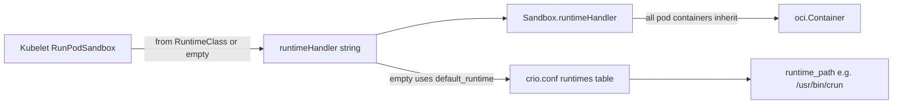
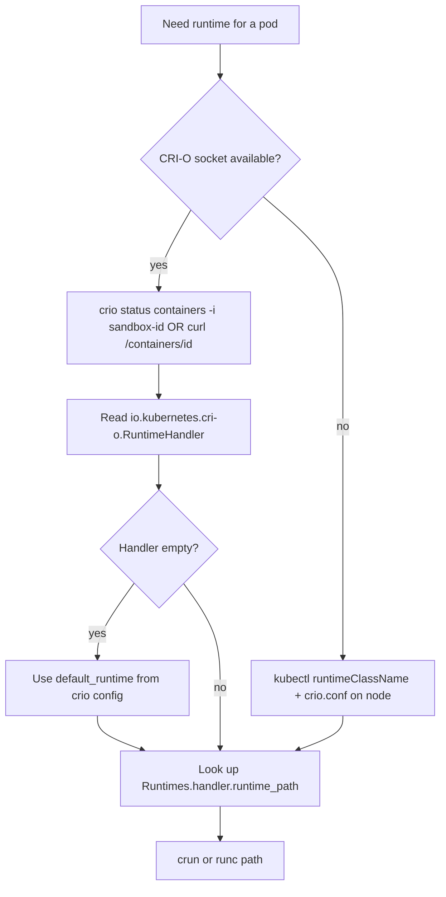

# Finding crun vs runc in CRI-O (without conmon)

<!-- toc -->

- [How CRI-O picks the runtime](#how-cri-o-picks-the-runtime)
- [Best methods (ranked)](#best-methods-ranked)
  - [1. CRI-O introspection API (recommended for live nodes)](#1-cri-o-introspection-api-recommended-for-live-nodes)
  - [2. Map handler name to crun/runc binary](#2-map-handler-name-to-crunrunc-binary)
  - [3. Kubernetes API (no CRI-O socket needed)](#3-kubernetes-api-no-cri-o-socket-needed)
  - [4. Offline / direct filesystem (no daemon, no conmon)](#4-offline--direct-filesystem-no-daemon-no-conmon)
- [What not to use (and why)](#what-not-to-use-and-why)
- [Practical decision tree](#practical-decision-tree)
- [Summary](#summary)
<!-- /toc -->

See also: [crio.conf.5.md](crio.conf.5.md) |
[container-creation-flow.md](container-creation-flow.md) |
[api-reference.md](api-reference.md)

---

CRI-O does not require inspecting conmon (or conmon-rs) to determine whether a
pod uses crun or runc. Runtime selection is handler-based and persisted on the
pod sandbox; you resolve the handler name to a binary via `crio.conf`.

## How CRI-O picks the runtime

Runtime selection is **handler-based**, not discovered from process trees:



Key code paths:

- Kubelet passes `runtimeHandler` in `RunPodSandboxRequest` (from pod
  `runtimeClassName` / RuntimeClass `.handler`, or empty for default).
- CRI-O validates and stores it on the sandbox in
  [`server/sandbox_run_linux.go`](../server/sandbox_run_linux.go) via
  `sbox.SetRuntimeHandler(runtimeHandler)`.
- Empty handler falls back to `default_runtime` in
  [`internal/oci/oci.go`](../internal/oci/oci.go) `getRuntimeHandler()`.
- Handler name maps to `runtime_path` in `[crio.runtime.runtimes.<name>]` per
  [crio.conf.5.md](crio.conf.5.md).

**Important:** crun vs runc is the **`runtime_path` for the handler**, not
something you infer from the workload PID or cgroup layout.

## Best methods (ranked)

### 1. CRI-O introspection API (recommended for live nodes)

Use the sandbox (pause/infra) container ID — in CRI-O this is typically the
**same as the pod sandbox ID**.

```bash
# Per-pod handler name
curl --unix-socket /var/run/crio/crio.sock \
  http://localhost/containers/<sandbox-id> | jq .

# Or CLI equivalent
crio status containers -i <sandbox-id>
```

Look in **Crio annotations** for:

`io.kubernetes.cri-o.RuntimeHandler`

- Empty value means the node **default** handler (see step 2).
- Non-empty value is the handler key (e.g. `crun`, `runc`).

This is written to the sandbox OCI spec in `setupSandboxAnnotations` and
restored on reboot via `LoadSandbox` in
[`internal/lib/container_server.go`](../internal/lib/container_server.go).

**Note:** Workload container IDs also work for sandbox lookup (`sandbox:` field
in output), but the handler annotation lives on the **infra/sandbox** spec —
query the sandbox ID for the cleanest result.

### 2. Map handler name to crun/runc binary

```bash
# Full runtime table + default
curl --unix-socket /var/run/crio/crio.sock http://localhost/config

# Or
crio status config

# Or CRI verbose status (used in CI)
crictl info -o json | jq '.config.crio.DefaultRuntime, .config.crio.Runtimes'
```

From config, read:

- `default_runtime` — used when handler is empty (common case on clusters
  without RuntimeClass).
- `Runtimes.<handler>.runtime_path` — actual binary (`/usr/bin/crun`,
  `/usr/bin/runc`, etc.).

Fedora/RHEL packaging often sets `default_runtime = "crun"`; older configs may
use `runc` ([crio.conf.5.md](crio.conf.5.md) documents `default_runtime="crun"`).

### 3. Kubernetes API (no CRI-O socket needed)

If you know the pod:

```bash
kubectl get pod <pod> -o jsonpath='{.spec.runtimeClassName}{"\n"}'
kubectl get runtimeclass <name> -o jsonpath='{.handler}{"\n"}'
```

Then map `.handler` to `runtime_path` in `crio.conf` on the node. If
`runtimeClassName` is unset, the pod uses CRI-O's `default_runtime`.

### 4. Offline / direct filesystem (no daemon, no conmon)

Sandbox metadata is persisted in container storage. On restore, CRI-O reads:

```bash
jq -r '.annotations["io.kubernetes.cri-o.RuntimeHandler"]' \
  /var/lib/containers/storage/containers/<sandbox-id>/userdata/config.json
```

(Exact storage path may vary with `storage.conf`; the `userdata/config.json`
OCI spec is the authoritative on-disk copy per `LoadSandbox` in
[`internal/lib/container_server.go`](../internal/lib/container_server.go).)

Combine with `grep -A5 '\[crio.runtime.runtimes.crun\]' /etc/crio/crio.conf`
(and runc section) to get the binary.

## What not to use (and why)

| Approach | Why it is weak |
|----------|----------------|
| Inspect conmon / conmon-rs process cmdline | Fragile; conmon-rs (`runtime_type = "pod"`) changes the process model |
| `/proc/<container-pid>/exe` or parent chain | Shows the **workload**, not the OCI runtime |
| cgroup path under `kubepods` | Same for crun and runc; encodes pod/sandbox, not runtime |
| Standard `crictl inspectp` / `PodSandboxStatus` | CRI API does **not** expose `runtimeHandler` in sandbox status — only CRI-O's internal annotations/config carry it |
| Workload container `crio status` alone | Handler is on sandbox spec; use sandbox ID or the `sandbox:` field first |

## Practical decision tree



## Summary

**Best overall:** `crio status containers -i <sandbox-id>` (or HTTP
`/containers/<sandbox-id>`) for the handler, then `crio status config` (or
`crictl info -o json`) to resolve `runtime_path`.

**Best without CRI-O daemon:** read sandbox `userdata/config.json` annotation +
`crio.conf` runtime table.

**Best without any node access:** Kubernetes `runtimeClassName` → RuntimeClass
`.handler` → documented node `crio.conf` mapping.

No conmon inspection is required because CRI-O records the decision at sandbox
creation time and persists it independently of the monitor process.
