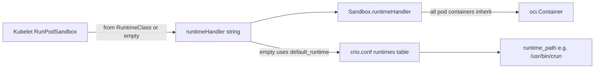
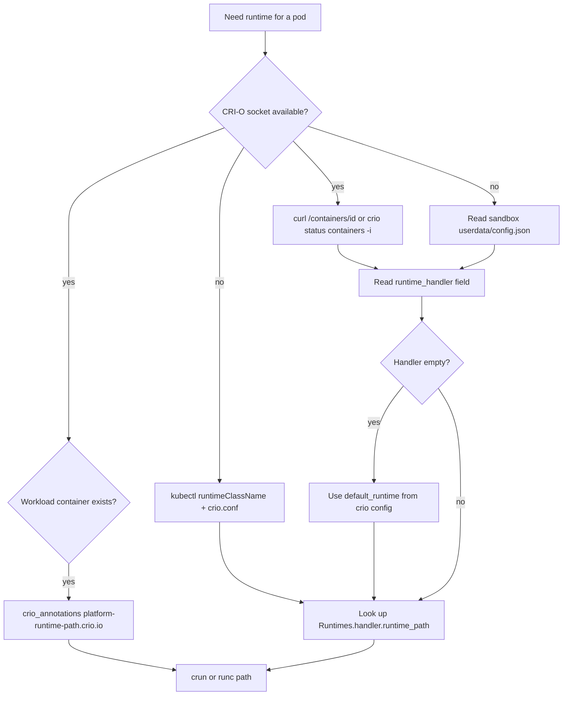

# Finding crun vs runc in CRI-O (without conmon)

<!-- toc -->

- [How CRI-O picks the runtime](#how-cri-o-picks-the-runtime)
- [Dropped infra containers (drop_infra_ctr)](#dropped-infra-containers-drop_infra_ctr)
- [Best methods (ranked)](#best-methods-ranked)
  - [1. CRI-O HTTP / CLI inspect (any container in the pod)](#1-cri-o-http--cli-inspect-any-container-in-the-pod)
  - [2. Workload container: direct runtime path](#2-workload-container-direct-runtime-path)
  - [3. Node config: map handler to binary](#3-node-config-map-handler-to-binary)
  - [4. Sandbox config.json on disk](#4-sandbox-configjson-on-disk)
  - [5. Kubernetes API (no CRI-O socket)](#5-kubernetes-api-no-cri-o-socket)
- [What not to use (and why)](#what-not-to-use-and-why)
- [Practical decision tree](#practical-decision-tree)
- [Summary](#summary)
<!-- /toc -->

See also: [crio.conf.5.md](crio.conf.5.md) |
[container-creation-flow.md](container-creation-flow.md) |
[api-reference.md](api-reference.md)

---

CRI-O does not require inspecting conmon (or conmon-rs) to determine whether a
pod uses crun or runc. Runtime selection is handler-based and persisted on the
pod sandbox; you resolve the handler name to a binary via `crio.conf`.

## How CRI-O picks the runtime

Runtime selection is **handler-based**, not discovered from process trees:



Key code paths:

- Kubelet passes `runtimeHandler` in `RunPodSandboxRequest` (from pod
  `runtimeClassName` / RuntimeClass `.handler`, or empty for default).
- CRI-O validates and stores it on the sandbox in
  [`server/sandbox_run_linux.go`](../server/sandbox_run_linux.go) via
  `sbox.SetRuntimeHandler(runtimeHandler)`.
- Empty handler falls back to `default_runtime` in
  [`internal/oci/oci.go`](../internal/oci/oci.go) `getRuntimeHandler()`.
- Handler name maps to `runtime_path` in `[crio.runtime.runtimes.<name>]` per
  [crio.conf.5.md](crio.conf.5.md).

**Important:** crun vs runc is the **`runtime_path` for the handler**, not
something you infer from the workload PID or cgroup layout.

## Dropped infra containers (drop_infra_ctr)

Most current clusters (including OpenShift) run with `drop_infra_ctr = true`
in `crio.conf`. When the infra (pause/POD) container is dropped, CRI-O still
creates a **spoofed** POD entry for sandbox metadata, but it does not run a real
pause container.

Spoofed POD containers look like this in the HTTP inspect API:

```json
{
  "name": "k8s_POD_...",
  "annotations": { "io.kubernetes.cri-o.Spoofed": "true" },
  "crio_annotations": null
}
```

`crio_annotations` is empty for spoofed containers because they never received a
full OCI spec in memory. The runtime handler is still stored on the **sandbox**
object and in the on-disk `userdata/config.json`.

Do **not** expect `io.kubernetes.cri-o.RuntimeHandler` in `crio_annotations` on
the POD/sandbox ID. Use the methods below instead.

## Best methods (ranked)

### 1. CRI-O HTTP / CLI inspect (any container in the pod)

The HTTP inspect endpoint returns `runtime_handler` from the pod sandbox for
**any** container ID in that pod (POD, workload, or sandbox ID).

```bash
# POD/sandbox ID or any workload container ID in the pod
curl --unix-socket /var/run/crio/crio.sock \
  http://localhost/containers/<container-id> | jq -r .runtime_handler

# Or CLI equivalent
crio status containers -i <container-id>
# prints: runtime handler: crun   (or empty = node default)
```

Example (spoofed POD container — handler comes from sandbox, not crio_annotations):

```bash
curl --unix-socket /var/run/crio/crio.sock \
  http://localhost/containers/9a080184a4b62... | jq '{runtime_handler, annotations}'
```

If `runtime_handler` is empty, the pod uses the node `default_runtime` (see
step 3).

### 2. Workload container: direct runtime path

For **non-spoofed workload containers**, `crio_annotations` includes the resolved
OCI runtime binary path. This skips the handler-to-config lookup.

```bash
# List workload containers (exclude POD)
crictl ps --pod <sandbox-id> --name table

curl --unix-socket /var/run/crio/crio.sock \
  http://localhost/containers/<workload-container-id> | \
  jq -r '.crio_annotations["platform-runtime-path.crio.io"] // .crio_annotations["io.kubernetes.cri-o.PlatformRuntimePath"]'
```

Returns e.g. `/usr/bin/crun` or `/usr/bin/runc` directly.

This does not apply to the spoofed POD container itself (step 1 or 4 instead).

### 3. Node config: map handler to binary

Once you have the handler name (from step 1, 4, or Kubernetes), resolve it
against the node configuration:

```bash
# Full runtime table + default (TOML)
crio status config

# Or same via HTTP
curl --unix-socket /var/run/crio/crio.sock http://localhost/config

# Or CRI status (JSON, used in CI)
crictl info -o json | jq '.config.crio.DefaultRuntime, .config.crio.Runtimes'
```

From config, read:

- `default_runtime` — used when `runtime_handler` is empty (common on clusters
  without RuntimeClass).
- `Runtimes.<handler>.runtime_path` — actual binary (`/usr/bin/crun`,
  `/usr/bin/runc`, etc.).

Fedora/RHEL packaging often sets `default_runtime = "crun"`; older configs may
use `runc` ([crio.conf.5.md](crio.conf.5.md) documents `default_runtime="crun"`).

**Example:** empty `runtime_handler` + `default_runtime = "crun"` → pod uses
`/usr/bin/crun` from `Runtimes.crun.runtime_path`.

### 4. Sandbox config.json on disk

Works without the CRI-O socket and for spoofed pods. The sandbox OCI spec is
written at pod creation (even when infra is dropped):

```bash
jq -r '.annotations["io.kubernetes.cri-o.RuntimeHandler"]' \
  /var/lib/containers/storage/containers/<sandbox-id>/userdata/config.json
```

(Exact storage root may vary with `storage.conf`; `userdata/config.json` under
the sandbox container directory is authoritative per `LoadSandbox` in
[`internal/lib/container_server.go`](../internal/lib/container_server.go).)

Combine with `crio status config` or `grep` in `/etc/crio/crio.conf` to map the
handler to `runtime_path`.

### 5. Kubernetes API (no CRI-O socket)

If you know the pod but not the container ID:

```bash
kubectl get pod <pod> -o jsonpath='{.spec.runtimeClassName}{"\n"}'
kubectl get runtimeclass <name> -o jsonpath='{.handler}{"\n"}'
```

Then map `.handler` to `runtime_path` in `crio.conf` on the node. If
`runtimeClassName` is unset, the pod uses CRI-O's `default_runtime`.

## What not to use (and why)

| Approach | Why it is weak |
|----------|----------------|
| `crio_annotations` on spoofed POD/sandbox ID | Always null when `drop_infra_ctr=true`; handler is on sandbox, not in-memory POD annotations |
| Inspect conmon / conmon-rs process cmdline | Fragile; conmon-rs (`runtime_type = "pod"`) changes the process model |
| `/proc/<container-pid>/exe` or parent chain | Shows the **workload**, not the OCI runtime |
| cgroup path under `kubepods` | Same for crun and runc; encodes pod/sandbox, not runtime |
| Standard `crictl inspectp` / `PodSandboxStatus` | CRI API does **not** expose `runtimeHandler` in sandbox status |

## Practical decision tree



## Summary

**Best per-pod (live):** `curl .../containers/<any-container-in-pod>` and read
`runtime_handler`, then `crio status config` (or `crictl info -o json`) to
resolve `runtime_path`. For workload containers, read
`platform-runtime-path.crio.io` from `crio_annotations` for the binary directly.

**Best without CRI-O daemon:** sandbox `userdata/config.json` +
`crio.conf` runtime table.

**Best without node access:** Kubernetes `runtimeClassName` → RuntimeClass
`.handler` → node `crio.conf` mapping.

**Spoofed POD caveat:** querying only the sandbox/POD ID will show
`crio_annotations: null` — that is expected with `drop_infra_ctr=true`. Use
`runtime_handler` on the inspect response, a workload container ID, or on-disk
`config.json`.

No conmon inspection is required because CRI-O records the decision at sandbox
creation time and persists it independently of the monitor process.
