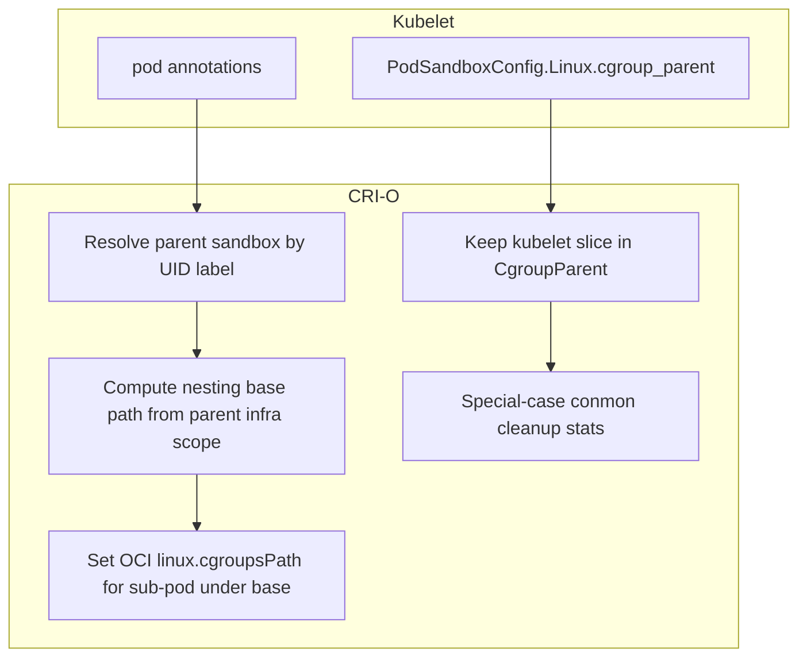

# Sub-pod cgroup nesting (design)

<!-- toc -->
- [Implementation status](#implementation-status)
- [Feasibility](#feasibility)
- [High-level design](#high-level-design)
- [Testing](#testing)
- [Implementation checklist](#implementation-checklist)
  - [Algorithm: <code>RunPodSandbox</code> (child)](#algorithm-runpodsandbox-child)
  - [Algorithm: workloads (<code>setupLinuxResources</code>)](#algorithm-workloads-setuplinuxresources)
  - [Lifecycle and side effects](#lifecycle-and-side-effects)
  - [Delegation](#delegation)
  - [Edge cases](#edge-cases)
  - [Comparison to commit <code>186af299</code>](#comparison-to-commit-186af299)
  - [Verification (before merge)](#verification-before-merge)
- [References](#references)
<!-- /toc -->

This document describes **sub-pod cgroup nesting** in CRI-O: placing a **child** pod’s cgroups **under** a **parent** pod’s scope on the host (cgroup v2), driven by an annotation on the child pod.

See also: [Container creation flow](container-creation-flow.md) · [Data structures](data-structures.md)

---

## Implementation status

**Implemented (annotation-driven):**

- Child pod annotation **`parent-pod-uid.crio.io`** (V2) or **`io.kubernetes.cri-o.ParentPodUID`** (V1), value = parent Kubernetes **pod UID** (the parent sandbox must already exist; resolved via label `io.kubernetes.pod.uid`).
- CRI-O keeps **`CgroupParent`** as the kubelet slice string; **`SubpodCgroupBase`** (absolute path under `/sys/fs/cgroup`) is stored on the sandbox for OCI paths and cleanup.
- **Not supported:** rootless, user-namespace mode, cgroup v1-only hosts, **cgroupfs** cgroup driver (non-systemd), or **chaining** (parent that is already a sub-pod).

**Conmon** still uses the kubelet **slice** for `MoveConmonToCgroup` (same as ordinary pods); only the workload/infra cgroup paths nest under the parent scope.

**High-performance runtime hooks** (`cpu-load-balancing`, `cpu-shared`, etc.) **skip cgroup manipulation** for sub-pods (log a warning); do not rely on those hooks for nested pods until extended.

---

---

## Overview

Today, each pod sandbox typically gets a **flat** placement: a `crio-<id>.scope` (systemd) under the kubelet-provided pod slice, not under another pod’s scope.

The goal is to optionally **nest** a child pod’s cgroup subtree **under** the parent pod’s scope on the host filesystem (cgroup v2), while preserving correct cleanup, runtime compatibility, and clear separation between what the **kubelet** thinks of as `cgroup_parent` and where CRI-O **actually** places the child on disk.

---

## Feasibility

**Yes, with constraints.** The kernel and cgroup v2 allow child cgroups under an existing cgroup when **delegation** and controller rules allow it. CRI-O already combines **systemd** for transient units with **cgroupfs-style** helpers in places (see `CreateSandboxCgroup` in `internal/config/cgmgr/systemd_linux.go`).

**Systemd limitation:** A second transient **`*.scope`** is normally created **under a slice**, not as a **child of another scope** via the same `Slice=` flow CRI-O uses today. Nesting under a parent pod therefore likely uses **explicit cgroup paths** under the parent’s cgroup directory (delegated subtree), not a second `slice:crio:childID` sibling under the QoS slice.

---

## Why the earlier enable_subpods attempt failed

The following issues were identified with commit `186af299` on branch `enable_subpods`:

1. **Wrong cgroup level for “parent path”.** The code used `SandboxCgroupManager(sbParent, sbID)` and `Path("")`. For the systemd manager, `SandboxCgroupManager` resolves only the **pod slice** (`sandboxCgroupAbsolutePath(sbParent)`), **not** the parent pod’s `crio-<id>.scope`. The `sbID` argument does not fix that. The child was nested next to **sibling** scopes under the slice, not under the parent **scope**.

2. **Correct API for parent scope on disk:** `ContainerCgroupAbsolutePath(parentCgroupParent, parentInfraContainerID)` (or `PodAndContainerCgroupManagers`), where `parentCgroupParent` is the parent sandbox’s kubelet `Linux.CgroupParent` stored via `setupSandboxCgroupPath`, and the container ID matches the **infra/pause** container used for that parent sandbox.

3. **`CgroupParent` overload.** Storing a **filesystem path** in `Sandbox.CgroupParent()` breaks callers that expect a **systemd slice** string (`ExpandSlice`, `RemoveSandboxCgroup`, `ContainerCgroupPath`, `MoveConmonToCgroup`, stats).

4. **OCI `linux.cgroupsPath`.** Sandboxes and workloads today use systemd-style paths (`slice:crio:<id>`) when the systemd cgroup driver is in use. Raw paths must match **runc/crun** expectations (relative vs absolute, cgroup v2 mount root, delegation).

5. **Annotation allowlisting.** The key must pass `FilterDisallowedAnnotations` and any admin allowlists in `crio.conf`.

---

## High-level design

**Kubelet** still sends `PodSandboxConfig.linux.cgroup_parent` and pod annotations. **CRI-O**:

1. Resolves the **parent sandbox** by Kubernetes pod UID (label `io.kubernetes.pod.uid`).
2. **Keeps** the child’s `CgroupParent` as the kubelet slice string for existing systemd-oriented APIs.
3. Computes a **nesting base** filesystem path from the **parent infra scope** (`ContainerCgroupAbsolutePath` + optional subdirectory such as `subpods/<child-sandbox-id>`).
4. Sets **`linux.cgroupsPath`** for the child sandbox and its containers to path-based locations **under** that base (validated against runc/crun).
5. Special-cases **cleanup**, **conmon**, and **stats** for sub-pods.



---

## Testing

- **Unit:** `internal/config/cgmgr/subpod_linux_test.go` (OCI-relative paths under the cgroup v2 mount).
- **Integration (BATS):** `test/subpod_cgroup_nesting.bats` — requires **cgroup v2**, **systemd** cgroup driver, and sufficient delegation on the parent pod scope (run with `sudo -E ./test/test_runner.sh subpod_cgroup_nesting.bats`).

---

## API surface

| Layer | Change |
| --- | --- |
| **Kubernetes / CRI (optional)** | Optional `PodSandboxConfig` field (e.g. parent UID); requires `cri-api`, kubelet, and usually a KEP. |
| **Annotation-only** | **`parent-pod-uid.crio.io`** (preferred) or **`io.kubernetes.cri-o.ParentPodUID`**. No CRI proto change if kubelet passes pod annotations on `RunPodSandbox`. |
| **CRI-O internal** | Sandbox fields for parent UID and nesting base path; cgroup helpers for sub-pod remove/stats. |
| **Operator docs** | Semantics, delegation, QoS / metrics limitations. |

---

## Risks and limitations

- **Kubelet accounting:** The kubelet still treats the child as its own pod; **host** cgroup nesting is a **runtime placement** choice. Metrics at the kubelet may not mirror the physical tree unless kubelet is extended.
- **Cgroup namespaces:** In-container cgroup paths may not show the full host hierarchy.
- **Path-based nesting:** The child likely cannot rely on a second systemd transient scope **under** the parent scope the same way as under a slice; expect **explicit paths** under a delegated parent.
- **Ordering:** Parent sandbox must exist before child creation; define errors and teardown order if the parent disappears.

---

## Implementation checklist

1. Resolve parent scope with `ContainerCgroupAbsolutePath` / `PodAndContainerCgroupManagers`, not `SandboxCgroupManager`.
2. Keep `CgroupParent` slice-based; add a separate nesting base path field on the sandbox.
3. Implement OCI `linux.cgroupsPath` for sandbox infra and workloads (`server/sandbox_run_linux.go`, `server/container_create.go` / `setupLinuxResources`).
4. Adjust `RemoveSandboxCgroup`, conmon, stats, NRI as needed.
5. Unit tests and BATS tests on real cgroup layouts.
6. Optional: KEP + CRI field for first-class Kubernetes support.

---

## Detailed design

### Goals and non-goals

**Goals**

- When a child pod references a parent (e.g. `io.kubernetes.cri-o.ParentPodUID` = parent’s Kubernetes pod UID), place the child’s cgroup **under** the parent pod’s cgroup subtree on the host.
- Preserve behavior for pods that do not opt in.
- Preserve the invariant that `Sandbox.CgroupParent()` remains the kubelet **slice** string for systemd (not a raw `/sys/fs/cgroup/...` path).

**Non-goals (initial phase)**

- Changing kubelet’s own cgroup accounting for each pod.
- Guaranteeing in-container cgroup path visibility when cgroup namespaces are used.

**Optional later**

- CRI field + kubelet behavior via KEP.

### Terminology

- **Pod / UID:** Kubernetes pod UID; sandboxes carry label `io.kubernetes.pod.uid`.
- **Sandbox:** One `RunPodSandbox` result; CRI sandbox ID + infra container.
- **Cgroup parent (CRI):** `PodSandboxConfig.linux.cgroup_parent` — under systemd, typically a **`.slice`** path.
- **Flat model:** Pod scope is a direct child of the pod slice, not of another pod’s scope.
- **Sub-pod:** Sandbox that nests under a parent sandbox’s cgroup tree.
- **Nesting base:** Host directory under the cgroup v2 mount used as the parent for the child’s cgroup subtree — **not** the same as the kubelet `CgroupParent` string.

### Current CRI-O behavior (baseline)

1. `setupSandboxCgroupPath` → `SandboxCgroupPath` → for systemd, `linux.cgroupsPath` like `slice:crio:<sandboxID>`.
2. `Sandbox.CgroupParent()` holds the systemd-oriented parent string for conmon, cleanup, stats, and `ContainerCgroupPath`.
3. Workloads use `ContainerCgroupPath(sb.CgroupParent(), containerID)` (systemd triple).
4. `ContainerCgroupAbsolutePath(sbParent, containerID)` yields the filesystem path to `crio-<containerID>.scope` under the expanded **slice** — that is the **pod scope** for the infra container.
5. `SandboxCgroupManager(sbParent, sbID)` targets the **slice**, not the pod scope; **do not** use it as the parent path for nesting under another pod’s scope.

### Target on-disk layout (conceptual, cgroup v2)

```text
/sys/fs/cgroup/kubepods.slice/kubepods-pod<parent>.slice/
  crio-<parentSandboxID>.scope/          # parent pod scope (existing)
    [optional: runtime leaves, e.g. container/]
    subpods/                             # suggested dedicated prefix
      <child cgroup subtree>
```

Use a **dedicated subdirectory** under the parent scope to avoid colliding with the parent’s own leaf cgroups.

### State model (illustrative field names)

| Field | Purpose |
| --- | --- |
| `ParentPodUID` | Kubernetes UID of parent (annotation or future CRI field). |
| `SubpodCgroupBase` | Filesystem path (relative to cgroup mount or per runtime contract) for the child’s subtree. |

**Do not** overload `CgroupParent`. Keep it as the kubelet slice string; use `SubpodCgroupBase` for nesting and nested cleanup.

### Algorithm: `RunPodSandbox` (child)

1. Parse parent reference from annotations (after filters/allowlists). If absent, use existing `setupSandboxCgroupPath` only.
2. Resolve parent sandbox by pod UID (prefer fast internal lookup).
3. Validate parent exists, lifecycle rules (optional: disallow chains of sub-pods unless explicitly supported).
4. Compute `parentScopePath := ContainerCgroupAbsolutePath(parent.CgroupParent(), parentInfraID)`.
5. `subpodBase := filepath.Join(parentScopePath, "subpods", childSandboxID)` (or equivalent unique path).
6. Check **delegation** / create errors; fail clearly if nesting is not allowed.
7. Set child infra `linux.cgroupsPath` per runc/crun rules (often **relative** to the unified cgroup mount).
8. Persist `ParentPodUID`, `SubpodCgroupBase`, and the child’s normal `CgroupParent` from kubelet.
9. Thread nesting state into `CreateContainer` for workloads under the child sandbox.

### Algorithm: workloads (`setupLinuxResources`)

For sub-pods, every code path that sets `linux.cgroupsPath` must avoid emitting a **sibling** `slice:crio:containerID` under the QoS slice; use path-based cgroups under the child’s subtree consistently with the infra container.

### Lifecycle and side effects

| Operation | Normal pod | Sub-pod |
| --- | --- | --- |
| Create sandbox | Systemd triple + slice checks | Path-based under `SubpodCgroupBase` |
| Remove sandbox | `RemoveSandboxCgroup(sb.CgroupParent(), sb.ID())` | Remove nested subtree only; do not pass fs paths to `ExpandSlice` |
| Conmon | `MoveConmonToCgroup` → slice | Still **slice** (same as flat pods); only infra/workload paths nest |
| Stats / NRI | `CgroupParent` / managers | Stats use **`SubpodCgroupBase`** for cgroup reads; NRI `GetCgroupParent()` remains the slice |
| Image pull | Uses sandbox cgroup | Ensure correct cgroup if applicable |

### Delegation

Nested cgroups require the parent cgroup to allow child creation (cgroup v2 delegation). Probe at create time and document supported kernel/runtime combinations.

### Edge cases

- Parent deleted before child: reject or define ordering on teardown.
- Invalid / duplicate UID: clear errors.
- Rootless / user namespaces: likely unsupported or extra constraints.

### Comparison to commit `186af299`

| Topic | Failed approach | Intended approach |
| --- | --- | --- |
| Parent path | `SandboxCgroupManager` → slice | `ContainerCgroupAbsolutePath` → parent **scope** |
| `CgroupParent` | Filesystem path | Keep slice string; add `SubpodCgroupBase` |
| OCI path | Join under wrong parent | Path under correct scope + dedicated subdirectory |
| Downstream | Broken conmon/cleanup/stats | Branch sub-pod in each consumer |

### Verification (before merge)

- Child cgroup appears under `ContainerCgroupAbsolutePath(parent)` + `subpods/<childSandboxID>` on the host.
- No regression for ordinary pods.
- Cleanup does not delete the parent scope or leak child state.
- Run **`test/subpod_cgroup_nesting.bats`** on a cgroup v2 + systemd node; test with **runc** and **crun** if both are supported.

---

## References

- `internal/config/cgmgr/systemd_linux.go` — `SandboxCgroupPath`, `ContainerCgroupAbsolutePath`, `SandboxCgroupManager`, `CreateSandboxCgroup`
- `server/sandbox_run_linux.go` — `setupSandboxCgroupPath`, `runPodSandbox`
- `server/container_create.go` — `setupLinuxResources`, cgroup path for containers
- `server/sandbox_remove.go` — sandbox cgroup removal
- `internal/config/cgmgr/subpod_linux.go` — nesting helpers, `EnsureSubpodSandboxCgroups`, removal
- `test/subpod_cgroup_nesting.bats` — integration test
