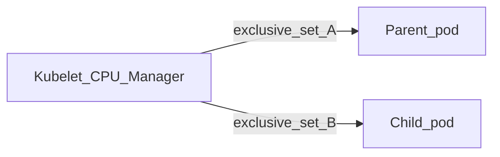

# Sub-pod cpuset partitioning (research)

## Table of contents

- [Purpose](#purpose)
- [Observed vs desired behavior](#observed-vs-desired-behavior)
- [Why nesting alone does not fix cpuset](#why-nesting-alone-does-not-fix-cpuset)
- [cgroup v2: domain parents and leaves](#cgroup-v2-domain-parents-and-leaves)
- [Conceptual parent annotation (not implemented)](#conceptual-parent-annotation-not-implemented)
- [Upstream dependencies](#upstream-dependencies)
- [Non-goals (reiteration)](#non-goals-reiteration)
- [References](#references)

This document is **research / architecture** only. It explains why **host cgroup path nesting** (see [Sub-pod cgroup nesting](subpod-cgroup-nesting.md)) does **not** by itself implement **CPU set partitioning** between a parent pod and a child sub-pod, and what would be required for a **single budget** split (e.g. parent workload vs child) on the node.

---

## Purpose

Operators may expect that when a **child** pod is nested under a **parent** pod on the host, the child’s `cpuset.cpus` is a **subset** of the parent’s allocation (e.g. parent `8-13`, child `14-15` from a shared `8-15` band). **Current** CRI-O sub-pod nesting changes **where** cgroups are attached on the filesystem; it does **not** change how the **kubelet** assigns **exclusive** CPUs to each **pod**.

---

## Observed vs desired behavior

- **Observed (typical static CPU Manager):** The **parent** pod receives one exclusive `cpuset.cpus` (e.g. `8-15`). The **child** pod receives a **second**, **disjoint** exclusive set (e.g. `16-17`) because the kubelet treats each pod as an independent consumer of the exclusive pool.
- **Desired:** Treat the **parent’s** kubelet-assigned band as a **single budget**, then **partition** it between parent workload and child (e.g. `8-13` vs `14-15`), so the child does **not** consume additional exclusive CPUs from the node pool.

---

## Why nesting alone does not fix cpuset

Sub-pod nesting adjusts **OCI `linux.cgroupsPath`** so the **child** sandbox lives under the **parent** `crio-<parentSandboxID>.scope` subtree (for example under `subpods/<childSandboxID>/`). That is **placement** on the host tree.

**Resource ownership** for exclusive CPUs is decided by the **kubelet CPU Manager** (policy, pod QoS, requests/limits). It assigns **`cpuset.cpus`** per **pod** unless upstream behavior is extended. **CRI-O** does not replace that allocator.

So the gap is **not** only layout; it is **coordination** between:

- what the **kubelet** believes each pod owns, and
- what **cpuset** is written for **parent** vs **child** cgroups on disk.

Until those align, **in-container** `cpuset.cpus` can remain **disjoint** even when paths nest.

Sets **A** and **B** are **independent** allocations under the default static model; **B** is not derived as a subset of **A**.

---

## cgroup v2: domain parents and leaves

Under **cgroup v2**, **domain** controllers (including **cpuset** in normal **domain** mode) follow constraints such that you cannot freely split `cpuset` to **child** cgroups while **runnable processes** remain in the **same** cgroup that must also act as a **parent** of those children—summarized often as **no internal process** for domain distribution.

A **practical** pattern for **hierarchical cpuset split** is:

1. An **empty** **parent** cgroup acts only as a **boundary**: `cpuset.cpus` = **union** of the intended band (e.g. `8-15`).
2. **All** tasks run in **leaf** cgroups (siblings under that boundary), e.g.:
   - leaf for **parent infra / workload** (subset `8-13`),
   - leaf under `subpods/<child>/...` for the **child** (subset `14-15`).

**Threaded** cgroup mode is a **narrow** kernel feature aimed at **thread**-level subtrees; it is **not** a general substitute for standard pod/container isolation when modeling “two pods, one budget” without careful kernel and runtime support.

---

## Conceptual parent annotation (not implemented)

A **future** direction discussed in design review is a **parent-pod opt-in** annotation meaning: “this pod is a **sub-pod parent**; treat its cgroup subtree as a **partition root** whose **domain** node holds the **full** kubelet-assigned resources (e.g. union `cpuset`), with **leaves** for parent workload and for **subpods**.”

That would imply **structural** changes to where CRI-O places **parent** infra and workload cgroups (not only child paths under `subpods/`). **Nothing in this document** defines a stable annotation name or API; it is **not** implemented today. Code touchpoints would include sandbox cgroup setup, infra creation, and workload `linux.cgroupsPath` (see [Sub-pod cgroup nesting](subpod-cgroup-nesting.md) for current layout).

---

## Upstream dependencies

Even with an **empty parent + leaves** cgroup tree in CRI-O, **kubelet** may still assign the **child** pod a **separate** exclusive `cpuset` under **static** CPU management unless behavior changes upstream.

Reasonable directions (conceptual):

| Direction               | Notes                                                                                                                                                                                                 |
| ----------------------- | ----------------------------------------------------------------------------------------------------------------------------------------------------------------------------------------------------- |
| **Kubelet / CRI / KEP** | First-class “sub-pod” or shared budget so the **child** does **not** take a **second** exclusive allocation; child cpuset is a **partition** of the **parent’s** assignment.                          |
| **Policy / scheduling** | Admission or scheduler rules so resource **requests** match the intended budget (orthogonal to cgroup layout).                                                                                        |
| **CRI-O-only override** | Forcing OCI `linux.resources.cpu` for the child **without** kubelet alignment risks **double booking**, wrong **allocatable**, and incorrect scheduling assumptions—**unsafe** as a general solution. |

---

## Non-goals (reiteration)

This matches the **non-goals** stated in [Sub-pod cgroup nesting — Goals and non-goals](subpod-cgroup-nesting.md#goals-and-non-goals): **changing kubelet’s own cgroup accounting** for each pod is **out of scope** for the initial sub-pod nesting work and remains a **cross-component** concern until explicitly designed (e.g. KEP-level).

---

## References

- [Sub-pod cgroup nesting](subpod-cgroup-nesting.md) — implemented path-based nesting, delegation, risks.
- Linux cgroup v2 documentation — **cpuset**, **domain**, **threaded** mode, delegation.
